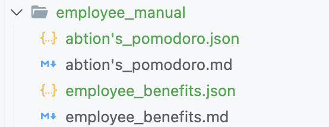
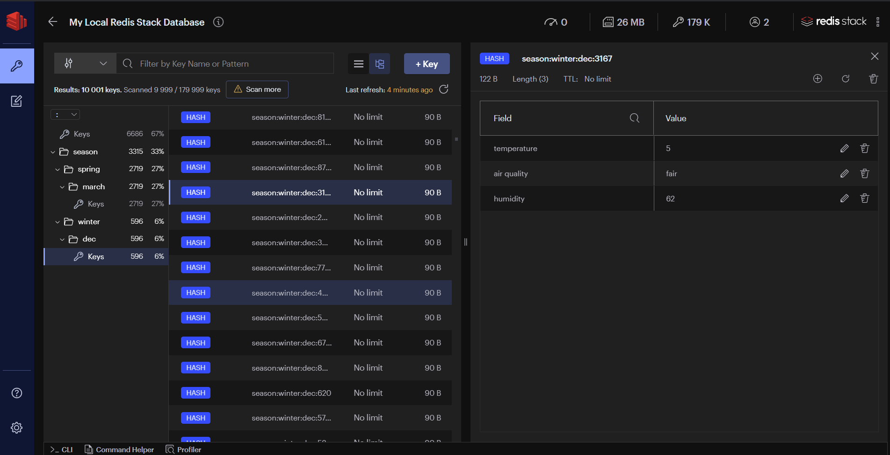

# Abtion's Dataset Repository

- [Abtion's Dataset Repository](#abtions-dataset-repository)
  - [Purpose](#purpose)
  - [Getting started](#getting-started)
  - [Working with the dataset](#working-with-the-dataset)
  - [Text-embedding generation script](#text-embedding-generation-script)
  - [Redis database population script](#redis-database-population-script)
    - [RedisInsight](#redisinsight)
  - [Contributions](#contributions)
  - [Guidelines](#guidelines)
  - [Questions?](#questions)

Welcome to Abtion's Dataset Repository! This is a centralized hub dedicated to the maintenance, enhancement, and exploration of the valuable datasets belonging to our organization. Here, you will find both text and markdown documents that capture and articulate various aspects of our organization. These files are intended for use in training text embedding models.

## Purpose

The primary purpose of this repository is to enable and encourage collaboration across different teams in our organization. This not only helps in ensuring the quality of the dataset but also assists in capturing a wider array of perspectives and information about our organization. The repository serves as a consistent, dependable, and easy-to-access resource for our datasets, assisting us in our efforts to create meaningful and accurate text embeddings.


## Getting started

The following environment variables are required to run the scripts:

| Variable | Description | Default
| --- | --- | ---
| REDIS_HOST | The host of the Redis database | localhost
| REDIS_PORT | The port of the Redis database | 6379
| REDIS_PASSWORD | The password of the Redis database | None
| OPENAI_API_KEY | The API key for the OpenAI API | None


You can set these environment variables in a `.env` file in the root of the repository. For example:

```bash
REDIS_HOST=localhost
REDIS_PORT=6379
OPENAI_API_KEY=123456
```

Once you have set the environment variables, you can install the dependencies:

```bash
pip install -r requirements.txt
```

## Working with the dataset

Setting up the project can be accomplished in two ways, depending on your specific needs:

1. **Regenerate the Embeddings:**

   If you have modified the documents and you wish to update the embeddings to reflect these changes, this is the option for you. In this case, you would need to run the text-embedding generation script. This will create new embeddings based on the current state of the documents and the embedding model, replacing the existing JSON files with updated ones.

2. **Populate Redis Database with Existing Embeddings:**

   If you are satisfied with the current state of the embeddings and do not wish to make any changes, you can skip the regeneration step. Instead, you directly run the Redis database population script. This script will load the existing embeddings (as they currently exist in the JSON files) into the Redis database.

## Text-embedding generation script

Our embeddings are produced utilizing OpenAI's `text-embedding-ada-v2` model. This model is powered to analyze and convert text data into meaningful embeddings, representing the nuanced semantic qualities of the content.

The script that generates the embeddings has already been executed, and as a result, our repository is populated with JSON files that contain the initial embeddings. These JSON files were created adjacent to the corresponding text or markdown files.



It's important to note that these embeddings are not static; they evolve as OpenAI trains the model or the documents change. Consequently, if the script is run again, it will regenerate the embeddings to reflect the changes brought about by further model training or document changes. This updated information will be stored in the same JSON files, ensuring that the embeddings remain current with the ongoing model development.

The script uses Python's `os.walk` function. It looks through all directories, starting from the root and going into subdirectories, searching for any files that end with .txt or .md. At the same time, it uses a tool called parse-gitignore. This tool ensures the script skips any directories or files that are listed in a .embedding_ignore file. This way, it only focuses on the files it's supposed to process, ignoring the rest.

Here's how to execute the script:

```bash
python generate_embeddings.py
```

Successful execution of the script will result in the creation of JSON files containing the embeddings. These files will be created adjacent to the corresponding text or markdown files.

## Redis database population script

The Redis database population script is responsible for loading the embeddings into the Redis database. The script will load the embeddings from the JSON files into the Redis database, ensuring that the database is populated with the latest embeddings.

```bash
python ingest_embeddings.py
```

### RedisInsight

RedisInsight is a GUI for Redis that allows you to interact with the Redis database. It can be used to view the contents of the database, run queries, and perform other operations. Download and install RedisInsight from [here](https://redislabs.com/redis-enterprise/redis-insight/). It is free to use.



## Contributions

We highly encourage contributions from everyone. However, to maintain the quality and coherence of the data, any modifications or additions to the dataset should be proposed via Pull Requests (PRs). The suggested process for making contributions is as follows:

1. **Clone** the repository to your local machine.
2. **Create a new branch** for your changes.
3. Make your changes and **commit** them with a clear and concise commit message.
4. **Push** your commits.
5. Make a **Pull Request**. Please ensure to provide a detailed description of the changes made and the reasons for them.

## Guidelines

* Please ensure that all text and markdown documents are structured and well-organized.
* Ensure that your changes do not inadvertently introduce any sensitive or private information.

## Questions?

Feel free to raise issues in case you have any questions or suggestions. We value your feedback and strive to create a positive and collaborative environment for all contributors.
